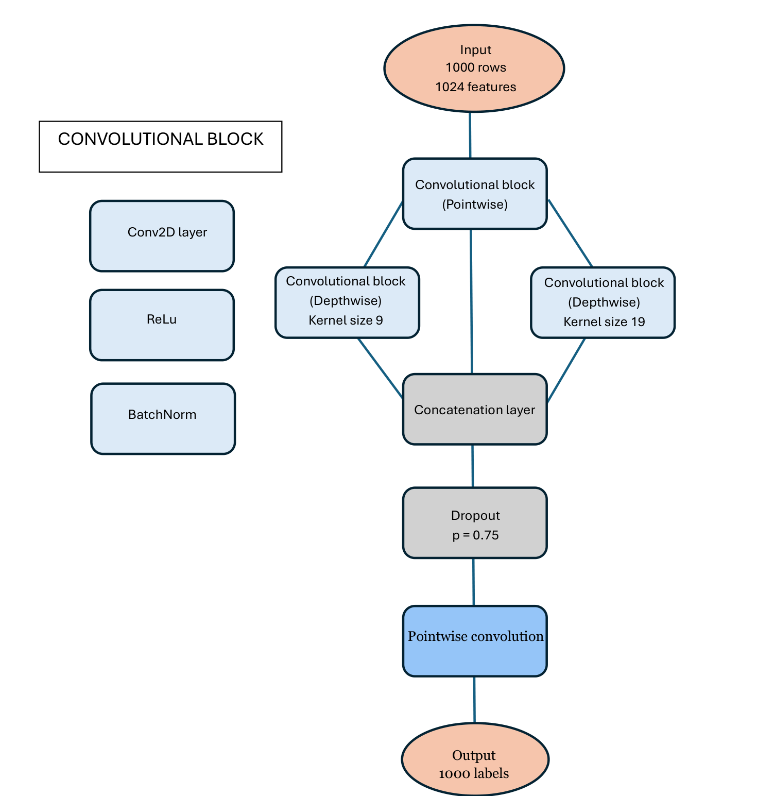
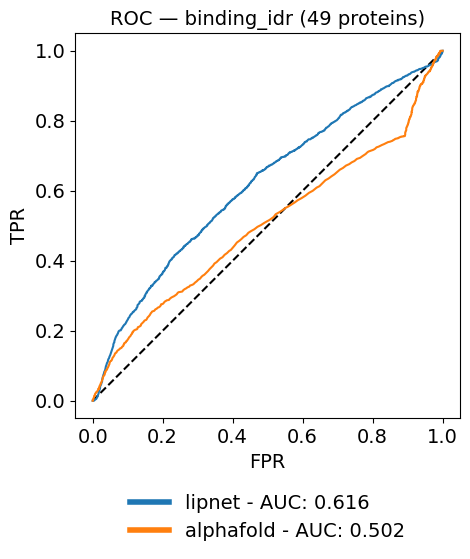
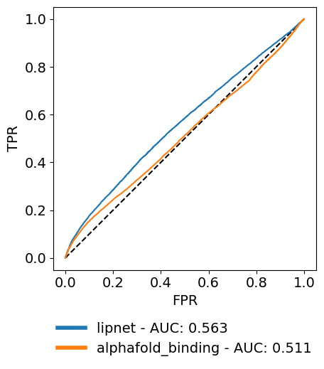
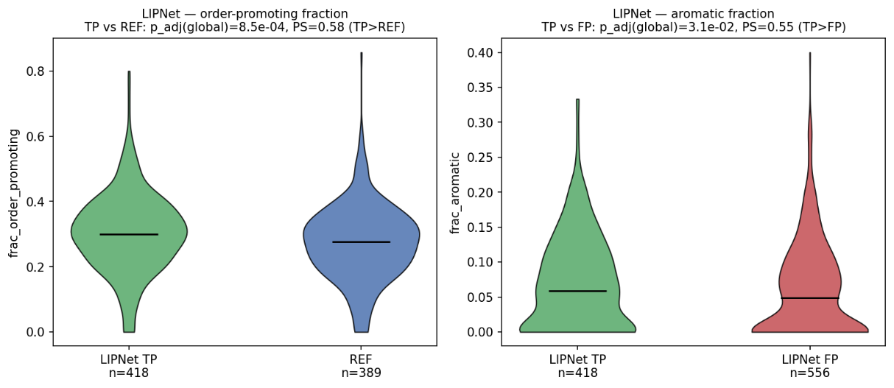

# Predicting binding within intrinsically disordered regions: LIPNet vs AlphaFold

Evaluation of two predictors of **binding residues inside intrinsically disordered
regions (IDRs)** — a sequence-based CNN (**LIPNet**) and a structure-based score
(**AlphaFold-binding**) — on two independent references, with a downstream
sequence/structure characterisation and a proteome-scale application.

> Master's thesis in Molecular Biology, University of Padova — *"Large-scale analysis
> of linear interacting peptides on model organisms"* (supervisor: Prof. Damiano
> Piovesan, BioComputingUP lab). This repository contains the analysis code and notebooks.

---

## The problem

About a third of the human proteome contains intrinsically disordered regions. Many
of these regions bind partners through a **coupled folding-and-binding** transition,
yet identifying *which residues* inside an IDR mediate binding remains an open problem:
disordered binding sites sit in no pre-formed pocket and are poorly conserved.

This work asks: **does a sequence-based deep model (LIPNet) identify disordered
binding residues better than a structure-derived signal (AlphaFold-binding)?** — and
**what kind of regions does each method actually predict?**

## Methods compared

| | **LIPNet** | **AlphaFold-binding** |
|---|---|---|
| Input | ProtT5 sequence embeddings (1024-d/residue) | AlphaFold2 structure (pLDDT + RSA) |
| Model | CNN: pointwise 1024→512, two depthwise branches (kernels **9** and **19**), concat + dropout, per-residue sigmoid | Piecewise score combining solvent accessibility and confidence |
| Signal | sequence | predicted structure |

The two kernel sizes mirror the two length populations of *linear interacting
peptides* (LIPs): ordered (~9 aa) and disordered (~19 aa).

<p align="center">
  
</p>
<p align="center"><em>LIPNet architecture: a pointwise block reduces the 1024-d ProtT5 embedding to 512, two parallel depthwise branches (kernels 9 and 19) capture local sequence patterns, and a final pointwise convolution yields one score per residue. (Diagram: Carangelo, LIPNet.)</em></p>

## Two independent references

- **CAID3 binding-IDR** — the official community benchmark (positives = GO `binding`
  descendants inside annotated IDRs).
- **DisProt (custom)** — a broader reference whose positive class unites GO binding
  annotations **with** IDPO *disorder-to-order* structural transitions, capturing the
  coupled folding-and-binding signature the thesis targets.

Evaluation is kept **internal to each reference** (same proteins, same protocol);
robustness comes from the two references agreeing, not from their absolute values.

## Key results

| Reference | Metric | LIPNet | AlphaFold-binding | Significance |
|-----------|--------|:------:|:-----------------:|--------------|
| CAID3 (49 proteins) | AUC-ROC | **0.616** | 0.502 *(chance)* | DeLong p = 2.7×10⁻³⁴ |
| CAID3 | AUC-PR | **0.492** | 0.427 | |
| DisProt (322 proteins) | AUC-ROC | **0.563** | 0.511 | DeLong p = 1.6×10⁻⁵³ |
| DisProt | AUC-PR | **0.448** | 0.414 | |

<p align="center">
  
  
</p>
<p align="center"><em>ROC curves on the CAID3 (left) and DisProt (right) references. LIPNet (blue) stays above the diagonal where AlphaFold-binding (orange) collapses to chance on CAID3.</em></p>

- LIPNet **ranks disordered binding residues significantly better** than
  AlphaFold-binding, consistently across both references. Absolute values stay modest
  — the binding-IDR task is genuinely hard and still open.
- **What LIPNet gets right carries the binding-competence signature**: its true
  positives are enriched in order-promoting and aromatic residues and are more
  ordered/helical than the mostly coil reference — the compositional fingerprint of
  coupled folding-and-binding. That same tendency is also its bias: it under-recovers
  the most disordered, coil-like binding regions.

<p align="center">
  
</p>
<p align="center"><em>Sequence composition (localCIDER). LIPNet's true positives are enriched in order-promoting residues vs the reference (left) and in aromatic residues vs its own false positives (right) — the compositional fingerprint of binding-competent regions.</em></p>
- AlphaFold-binding's predictions (especially its false positives) depart from real
  binding on several compositional axes at once — a consequence of selecting residues
  on structural exposure rather than sequence.
- **Proteome scale**: applied to *E. coli*, *S. cerevisiae* and *H. sapiens*, the
  binding-rich proteins share a structural/ribosomal enrichment (a length-bias
  artefact, flagged as such) but show organism-specific signatures consistent with
  disordered binding expanding with organismal complexity.

## Repository structure

```
.
├── src/                         # analysis library (flat package; see grouping below)
│   ├── cnn_architecture.py      #   MODEL: LIPNet CNN definition
│   ├── lipnet4.py               #   MODEL: inference driver
│   ├── lipnet4_embed.py         #   MODEL: ProtT5 embedding computation
│   ├── t5.py                    #   MODEL: ProtT5 encoder utilities
│   ├── reference.py             #   REFERENCE: DisProt 3-state reference construction
│   ├── disprot.py               #   REFERENCE: DisProt parsing
│   ├── ontology.py              #   REFERENCE: IDPO/GO term selection
│   ├── GO_terms_Obonet.py       #   REFERENCE: GO "binding" subtree from the ontology
│   ├── loader.py                #   EVAL: load LIPNet / AlphaFold predictions -> DataFrame
│   ├── cider.py                 #   EVAL: localCIDER physico-chemical descriptors
│   ├── cider_stats.py           #   EVAL: Mann-Whitney + BH correction on descriptors
│   ├── structural_stats.py      #   EVAL: RSA / pLDDT / secondary-structure stats
│   ├── delong_utils.py          #   EVAL: DeLong test for AUC differences
│   └── plots.py                 #   EVAL: ROC/PR, confusion matrices, violin plots
├── scripts/                     # command-line steps of the pipeline
│   ├── build_lipnet_fasta.py    #   Step 1: JSON -> FASTA for LIPNet
│   ├── download_alphafold_pdb.py#   Step 3: fetch AlphaFold structures
│   ├── run_alphafold_disorder.py#   Step 4: DSSP+pLDDT -> AlphaFold-binding score
│   └── compute_cider.py         #   descriptor tables + figures (min_length=5)
├── notebooks/
│   ├── evaluation.ipynb         # main evaluation (ROC/PR, confusion, CIDER) — rendered
│   └── detailed_analysis.ipynb  # extended structural/compositional analysis — rendered
├── data/
│   ├── references/              # committed 3-line CAID reference FASTAs
│   └── README.md                # how to obtain the large inputs / weights
├── docs/PIPELINE.md             # end-to-end reproduction steps
├── requirements.txt
└── LICENSE
```

`src/` is a flat package because its modules import each other by name
(`import reference`, `import loader`, …); the comments above show the logical grouping
into **model**, **reference construction**, and **evaluation**.

## Installation

```bash
python -m venv .venv && source .venv/bin/activate   # Windows: .venv\Scripts\activate
pip install -r requirements.txt
```
Python 3.10+ recommended. LIPNet inference needs a GPU (ProtT5 is large); the
evaluation and analysis code runs on CPU.

## Usage

The full reproduction path is documented in **[docs/PIPELINE.md](docs/PIPELINE.md)**.
In short:

```bash
python scripts/build_lipnet_fasta.py        # FASTA for LIPNet
python scripts/download_alphafold_pdb.py    # AlphaFold structures
python scripts/run_alphafold_disorder.py    # AlphaFold-binding score
# ...then CAID scoring, then the analysis notebooks
```

The large inputs (ProtT5 / LIPNet weights, DisProt release, PDB structures, GO ontology)
are **not** in the repo — see **[data/README.md](data/README.md)** for where to get them.
The notebooks are shipped with their rendered figures as a record of the analysis.

## Credits

- **LIPNet** — CNN predictor developed by Riccardo Carangelo, BioComputingUP,
  University of Padova · [BioComputingUP/LIPNet](https://github.com/BioComputingUP/LIPNet)
- **AlphaFold-disorder** — [BioComputingUP/AlphaFold-disorder](https://github.com/BioComputingUP/AlphaFold-disorder)
- **CAID scorer** — [BioComputingUP/CAID](https://github.com/BioComputingUP/CAID)
- **localCIDER** — Pappu Lab · **ProtT5** — Rostlab/ProtTrans

## Author

**Andrea Attura** — MSc Molecular Biology, University of Padova.

## License

MIT — see [LICENSE](LICENSE). Third-party tools and databases retain their own licenses.
